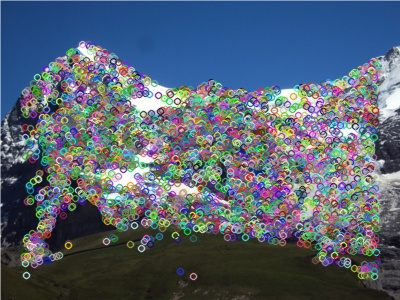
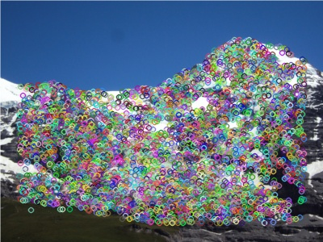
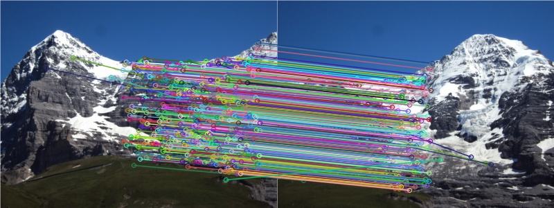
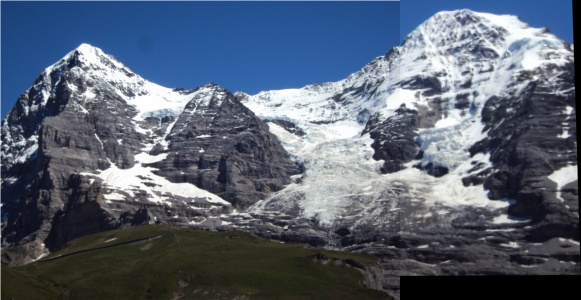

# Image Stitching 

## Instructions

1. This code was written in C++, using CodeBlocks on a Windows 10 machine.
2. The opencv_contrib modules must be added to the existing OpenCV libraries to run the code.
3. The project is an image stitching application using AGAST and FREAK feature detector and descriptor respectively.
4. The folder “images” contains the input images to be fed to the application.  
There are three pairs of images: one for a beach, one for a mountain, and one taken from a
video game.
5. The folder “output_images” is the folder to which the images with key points, images
with matches, warped image, and stitched image are written.
6. To run the code, open main.cpp file with CodeBlocks, provide the right paths for the two
images, and click on the build and run button.

 

 

